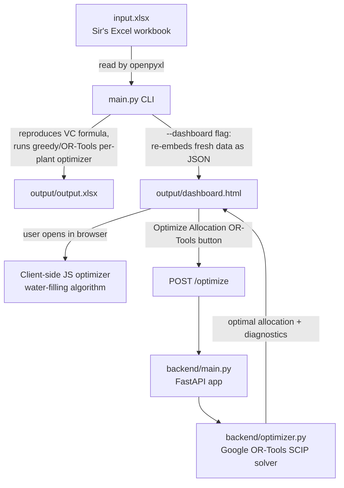

# Coal Rake-Mix Optimizer — Project Summary (Knowledge Transfer)

## 1. What problem is this solving?

UPRVUNL (a power utility) runs several coal power plants. Each plant gets its
coal from more than one coal company (BCCL, CCL, SECL, NCL, ECL...), and each
company's coal costs a different amount once you add transport ("freight")
and adjust for quality (ash content, calorific value, etc.). That final,
adjusted cost per unit of electricity is called the **Variable Charge (VC)** —
lower is better, because it means cheaper power.

Every month, someone manually decides how many rakes (trainloads of coal)
each plant should receive from each company. This project's job is to **help
pick a better mix of rakes per company/plant combination, so the blended
Variable Charge for every plant is pushed down to a target ceiling
(₹4.00/unit)** — without breaking a set of business rules (a plant can't
suddenly take way more/less coal than usual, a single company's total supply
across all plants can't just be reshuffled, etc.).

In short: **"Given the coal we're already contracted to receive, how do we
re-arrange which plant gets which company's coal, to make electricity
cheaper, without violating the rules?"**

## 2. The three pieces of this project

```
coal-optimizer-package/
├── input.xlsx              ← the source-of-truth Excel workbook (Sir's sheet)
├── daily_variation.csv     ← optional: "today only X rakes are available" overrides
├── main.py                 ← CLI: the Python script that reproduces the Excel logic
├── dashboard_template.html ← the dashboard's SOURCE file (you edit this one)
├── output/
│   ├── dashboard.html      ← GENERATED: template + live data baked in — open this in a browser
│   └── output.xlsx         ← GENERATED: result of running main.py
└── backend/                ← a small web service that does the "real" optimization
    ├── main.py              (FastAPI app, exposes POST /optimize)
    ├── optimizer.py          (the actual Google OR-Tools solver logic)
    ├── schemas.py             (defines the shape of the request/response JSON)
    └── requirements.txt
```

Think of it as **one dataset (`input.xlsx`) feeding three different "views"**:

1. **A command-line report** (`main.py`) — prints numbers to the terminal and
   saves an Excel file. Good for quick checks / automation.
2. **A visual dashboard** (`output/dashboard.html`) — a single HTML file
   anyone can open by double-clicking, no install needed. Has its own simple
   built-in optimizer written in JavaScript.
3. **A proper optimization server** (`backend/`) — a small API that uses a
   real constraint-solver (Google OR-Tools) to compute the mathematically
   optimal rake allocation. The dashboard has a button that calls this
   server for a more rigorous answer than its own built-in JS optimizer.

## 3. The core formula (used everywhere)

For a coal source `s` at a plant:

```
Landed Cost (Rs/MT) = Rate + Freight
Variable Charge (VC) = Landed Cost × SCC ÷ (1 − APC%) ÷ 1000
```

- **Rate** — price of the coal itself (Rs per metric tonne).
- **Freight** — cost to transport it to the plant (Rs per metric tonne).
- **SCC** (Specific Coal Consumption) — how much coal (kg) is burned to make
  1 unit of electricity. Lower SCC = more efficient = cheaper per unit.
- **APC%** (Auxiliary Power Consumption) — % of generated power the plant
  itself consumes to run its own equipment; this "eats into" useful output,
  so it inflates the effective cost per unit.

A plant's overall VC is the **rake-weighted average** of its sources' VCs:

```
Plant Weighted VC = Σ(rakes_from_source × VC_of_source) / Σ(rakes_from_source)
```

The whole project exists to move rakes between sources so this weighted
average drops toward the ₹4.00 (or ₹3.99, depending on the sheet) target.

## 4. Workflow — how data flows through the system



### Path A — CLI only (`main.py`)
1. Reads `input.xlsx`, sheet `"July 2026 (3)"`, into a table of
   Plant / Source / Rakes / Variable Cost.
2. Recomputes each plant's weighted VC and the overall portfolio VC — this
   is a sanity check that Python's numbers match the Excel's numbers.
3. Runs a small demo: what happens if we manually change one cell (Parichha's
   NCL rakes from 60 → 52)?
4. Optionally overlays a `daily_variation.csv` (e.g. "today NCL only has 52
   rakes available for Parichha, not the monthly-planned 60").
5. Runs `optimize_all_plants()` — for each plant independently, re-arranges
   the rakes across its own sources to minimize that plant's VC, while
   keeping each source between 40%–120% of its original value and the plant's
   total between 80%–110% of its original total. Uses OR-Tools if available,
   otherwise a simpler "greedy" fallback (see §6).
6. Optionally applies **freezes** — pins specific (plant, source) rake counts
   so the optimizer must work around them (e.g. a contractual minimum).
7. Saves everything to `output/output.xlsx`.
8. Optionally (`--dashboard` flag) regenerates `output/dashboard.html` with
   fresh numbers pulled straight from `input.xlsx`'s `"Calculation Sheet"`.

### Path B — Dashboard, client-side only
1. Open `output/dashboard.html` in any browser — no server needed.
2. All the data (`RAW_DATA`) is embedded directly in the HTML as JSON — this
   is what step 8 above regenerates.
3. Its own JavaScript optimizer (`optimizePlant()`) runs a **"water-filling"**
   allocation (see §6) entirely in the browser when you click "Optimize this
   plant" or "Optimize all plants".
4. You can tweak Rate/Freight/SCC/APC/Min%/Max% for any source directly in
   the table and everything recalculates live.

### Path C — Dashboard + real backend (most rigorous)
1. Run the FastAPI server (`backend/main.py`), typically as a Docker
   container so it isn't affected by local OS restrictions on native
   libraries.
2. Click **"Optimize Allocation (OR-Tools)"** on the dashboard.
3. The dashboard's JS builds a JSON payload of every plant/source's current
   rakes, VC, and min/max bounds (`buildOptimizePayload()`), and POSTs it to
   `http://localhost:8000/optimize`.
4. `backend/optimizer.py` builds an actual Integer Linear Program (ILP) and
   solves it with Google OR-Tools (SCIP solver) — this considers **all
   plants and all companies together at once**, unlike the CLI/JS optimizers
   which only look at one plant at a time.
5. The result (optimal allocation, which plant/source pairs changed, and a
   constraint-satisfaction report) is rendered back into the dashboard.

## 5. Module-by-module: what each file does

| File | Role | Function of each key piece |
|---|---|---|
| **`input.xlsx`** | Data source | Two sheets matter: `"July 2026 (3)"` (Plant/Source/Rakes/VC table used by the CLI) and `"Calculation Sheet"` (the detailed Rate/Freight/SCC/APC breakdown used by the dashboard). |
| **`daily_variation.csv`** | Optional override | A tiny CSV of `plant, source, available_rakes` — lets you say "today, fewer rakes are actually available than the monthly plan," without editing the Excel. |
| **`main.py`** | CLI entry point | See function table below. |
| **`dashboard_template.html`** | Dashboard source | The file you actually edit. Contains all HTML/CSS/JS. `main.py --dashboard` swaps in fresh data and writes the result to `output/dashboard.html`. |
| **`output/dashboard.html`** | Generated dashboard | Never edit this directly — it gets overwritten every time you regenerate. |
| **`output/output.xlsx`** | Generated report | The CLI's final answer sheet: original vs. optimized rakes per plant/source, with target-achieved status. |
| **`backend/main.py`** | API entry point | Defines the FastAPI app, CORS settings (so the dashboard's `file://` page is allowed to call it), `GET /health`, and `POST /optimize`. |
| **`backend/optimizer.py`** | The real solver | Builds and solves the ILP with OR-Tools — see §6. |
| **`backend/schemas.py`** | Data contracts | Pydantic models describing exactly what JSON the API expects in a request and returns in a response (so both sides — dashboard and backend — agree on the shape of the data). |
| **`backend/requirements.txt`** | Dependencies | `fastapi`, `uvicorn`, `ortools`, `pydantic` pinned to specific versions. |

### Functions inside `main.py` (CLI)

| Function | In plain words |
|---|---|
| `read_rake_data()` | Opens the Excel file and pulls out a clean table of Plant/Source/Rakes/VC, handling the sheet's merged cells (plant name only appears once per block). |
| `clean_and_validate()` | Basic sanity checks — no negative rakes, no missing VC values. |
| `compute_weighted_vc()` | Calculates each plant's and the whole portfolio's rake-weighted average VC — this is the "current state" baseline everything else compares against. |
| `manual_change_test()` | A demo showing what happens to a plant's VC if you manually override one source's rake count. |
| `apply_daily_variation()` | Overlays the optional `daily_variation.csv` on top of the monthly plan. |
| `parse_freeze_arg()` | Parses the `--freeze "Plant:Source=Value"` command-line flag into a lookup dict. |
| `optimize_plant()` | The actual per-plant optimizer: picks new rake counts per source to minimize that plant's VC, subject to min/max bounds and any frozen cells. Tries OR-Tools first, falls back to a greedy heuristic. |
| `optimize_all_plants()` | Just runs `optimize_plant()` once per plant. |
| `read_calculation_sheet()` | Reads the more detailed "Calculation Sheet" (Rate, Freight, SCC, APC, etc. — the numbers the dashboard's own formula needs). |
| `export_html()` | Takes `dashboard_template.html`, finds the `RAW_DATA` JavaScript block, and replaces it with fresh JSON from `input.xlsx` — this is how the dashboard "stays in sync" with the Excel file. |
| `main()` | Wires all of the above together in order, following the CLI flags (`--daily`, `--freeze`, `--dashboard`). |

### Functions inside `dashboard_template.html` (JavaScript)

| Function | In plain words |
|---|---|
| `unitVC(s)` / `landedCost(s)` | The core VC formula from §3, applied to one source. |
| `buildState()` | Turns the raw embedded data into a working copy the UI can mutate (adds current share %, min/max %, etc.) without touching the original numbers. |
| `applyFlexBand()` | Auto-sets each source's Min/Max % to "current % ± a band" (default ±20 percentage points) — a quick way to bound the optimizer without manually typing every cell. |
| `optimizePlant()` | The browser's own optimizer — a **water-filling** algorithm (see §6). |
| `applyOptimizedToPlant()` | Takes the optimizer's suggested split and actually makes it "the new current split," so the change is visible in the charts/numbers. |
| `renderKPI()` / `renderTabs()` / `renderPanel()` / `render()` | Redraw the top KPI strip, the plant tabs, and the detailed plant panel respectively, whenever data changes. |
| `renderTrain()` | Draws the little colored "train wagon" bar chart showing each source's share visually. |
| `buildOptimizePayload()` | Packages the current on-screen data into the exact JSON shape the backend API expects. |
| `renderServerOptimizeResult()` | Renders the backend's response (optimal allocation, diversion list, constraint checks) into its own panel on the page. |
| Event listeners (bottom of file) | Wire up every button/input (Optimize this plant, Optimize all, Reset, target ceiling box, per-cell edits, the OR-Tools button) to the functions above. |

### Functions inside `backend/optimizer.py`

| Function | In plain words |
|---|---|
| `_weighted_vc(rows)` | Same weighted-average VC calculation as the CLI, just used to report "before" and "after" numbers. |
| `optimize(request)` | The main solver: <br>1. Flattens the request into (plant, company, planned rakes, VC, min, max) rows.<br>2. Creates one integer decision variable per plant-company pair.<br>3. Adds 5 constraints (see §6).<br>4. Minimizes total weighted cost.<br>5. Solves with SCIP and packages the result, including a human-readable list of what changed ("diversions") and a pass/fail report for every constraint. |

## 6. The two different optimizers explained (and why they differ)

There are actually **three** optimizers in this project, each a bit smarter
than the last:

1. **CLI greedy fallback** (`main.py`, used only if OR-Tools can't load):
   sorts sources cheapest-first and dumps as many rakes as allowed into the
   cheapest one, then the next, etc., until the plant's total is used up.
   Fast, but not always truly optimal when there are many competing bounds.

2. **Dashboard's JS "water-filling"** (`dashboard_template.html`,
   `optimizePlant()`): same greedy idea, but works in **percentage shares**
   (0–100%) instead of raw rake counts, and only ever looks at **one plant
   at a time** — it doesn't know or care what other plants are doing with
   the same coal company.

3. **Backend's OR-Tools ILP solver** (`backend/optimizer.py`): the
   mathematically rigorous version. It looks at **all plants and all
   companies simultaneously** and enforces 5 real constraints at once:
   1. **Company conservation** — each coal company's total supply across
      all plants combined must stay exactly the same before/after (you're
      not changing how much coal a company sells overall, just who gets it).
   2. **Plant total bounds** — each plant's total rakes must stay within
      80%–110% of its original total (configurable).
   3. **Plant-company bounds** — each individual plant/company allocation
      must stay within the min/max the dashboard sent for it.
   4. **Global total conservation** — automatically true if #1 holds for
      every company.
   5. **Integer allocation** — you can't have half a rake.
   It then reports which constraints ended up satisfied, as a transparency
   check. This is why the OR-Tools result can look different (and better)
   than either of the two simpler optimizers — it's solving a much bigger,
   properly linked problem instead of one plant in isolation.

## 7. Known assumptions / things worth double-checking against the source Excel

- Sources with **zero current allocation** get a fallback upper bound of
  50% of the plant's total rakes in the dashboard's JS optimizer, since
  there's no explicit company-wide cap available for those rows.
- The backend's 5 constraints are exactly what's described above — nothing
  about the allocation logic is hardcoded; every number comes from whatever
  the dashboard/CLI sends it.
- The target ceiling (₹4.00 in the dashboard, ₹3.99 as `TARGET_VC` in the
  CLI) comes from a specific cell in the Excel sheet (`N17` in `"July 2026
  (3)"`) — if the source sheet's target changes, both places need updating.

## 8. Running it locally (short version — see `README.md` for full detail)

```bash
# CLI
pip install pandas openpyxl ortools
python main.py --dashboard dashboard_template.html

# Backend (recommended: via Docker, to avoid native-library OS restrictions)
cd backend
docker build -t coal-optimizer-backend .
docker run -d --name coal-optimizer-backend -p 8000:8000 coal-optimizer-backend

# Dashboard
# Just open output/dashboard.html directly in a browser (double-click it,
# or paste its file:// path into the address bar).
```
